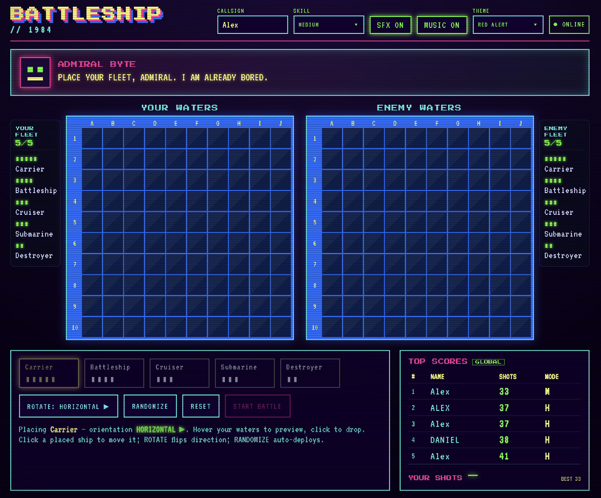

# 🕹️ RETRO BATTLESHIP // 1984

A neon, CRT-soaked, 80s-arcade take on **Battleship**, played online against
**Admiral Byte** — a gleefully trash-talking AI. Built to be fun to play and
genuinely pleasant to read, change, and operate.

> **Play it:** <https://dist-xszqiqsl.devinapps.com>
>
> **Bug report:** [`docs/BUGS.md`](docs/BUGS.md)



## Features

- **Classic rules** — 10×10 grid, standard fleet (5/4/3/3/2), drag-free
  click-to-place with rotate + randomize.
- **Three AI difficulties** — easy (random), medium (hunt/target), hard
  (hunt/target + **parity search** for optimal hunting).
- **80s arcade aesthetic** — neon palette, CRT scanlines, flicker, pixel fonts,
  glow effects.
- **Web Audio sound** — all SFX and chiptune music are *synthesized in-browser*
  (no asset downloads), with SFX/music toggles.
- **Smack talk** — Admiral Byte reacts to every event with a typewriter taunt.
- **Resilient by design** — the game runs **fully client-side**; the backend is
  an enhancement, and the UI gracefully falls back to a local AI + taunts if the
  API is unreachable.
- **Observability + HA** — an OpenTelemetry-instrumented FastAPI backend with a
  ready-to-run Collector → Jaeger/Prometheus/Grafana stack and a 2-replica
  load-balanced demo. See [`docs/HA_AND_OBSERVABILITY.md`](docs/HA_AND_OBSERVABILITY.md).

## Architecture

```
┌──────────────────────────┐        ┌───────────────────────────────┐
│  Frontend (React + TS)   │        │  Backend (FastAPI + OTel)     │
│  • game logic + AI        │  HTTP  │  • /api/ai/move               │
│  • Web Audio engine       │ ─────▶ │  • /api/taunt                 │
│  • retro CRT UI           │ ◀───── │  • /api/games /leaderboard    │
│  • graceful local fallback│  (opt) │  • /health /ready             │
└──────────────────────────┘        └───────────────┬───────────────┘
        static hosting (CDN)                         │ OTLP
                                                     ▼
                                   Collector → Jaeger / Prometheus / Grafana
```

The **frontend is the source of truth** for game state; the backend is
stateless (aside from an optional leaderboard file), so it scales horizontally.

## Project layout

| Path             | What                                                        |
| ---------------- | ---------------------------------------------------------- |
| `frontend/`      | React + TypeScript + Vite app (game logic, UI, audio)     |
| `backend/`       | FastAPI service (AI, taunts, leaderboard) + OTel           |
| `observability/` | docker-compose HA + OTel/Jaeger/Prometheus/Grafana stack   |
| `docs/`          | Bug report, HA & observability notes                       |

## Quick start

### Frontend

```bash
cd frontend
npm install
npm run dev            # http://localhost:5173  (LOCAL AI MODE)
```

To play against the backend, copy `.env.example` to `.env` and set
`VITE_API_BASE_URL=http://localhost:8000`.

### Backend

```bash
cd backend
uv sync --extra dev
uv run uvicorn app.main:app --reload --port 8000
```

### Full HA + observability demo

```bash
cd observability
docker compose up --build
# API (load-balanced) http://localhost:8080 · Jaeger :16686 · Grafana :3000
```

## Testing

```bash
# frontend
cd frontend && npm run typecheck && npm run lint && npm test

# backend
cd backend && uv run ruff check . && uv run pytest
```

## Tech

React 19 · TypeScript · Vite · Vitest · FastAPI · Pydantic v2 · OpenTelemetry ·
nginx · Jaeger · Prometheus · Grafana
